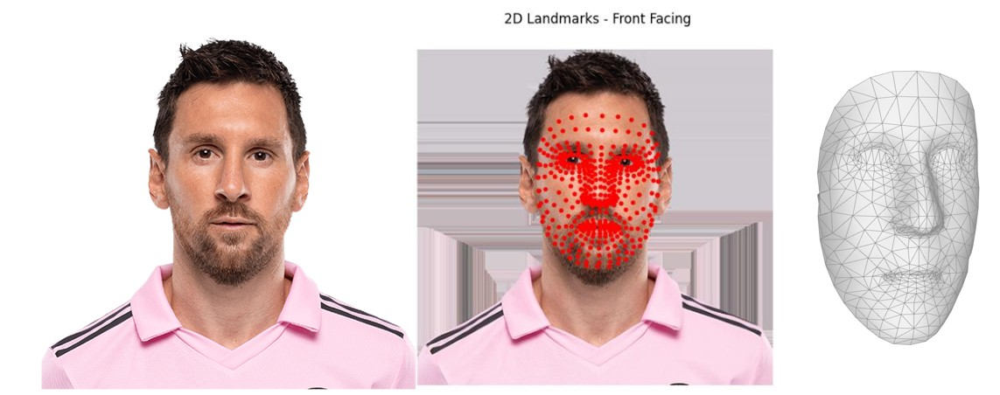

# 3D Head Reconstruction Project

## Overview
This project reconstructs a 3D volumetric representation of a human head using landmarks extracted from a video or a single image. It currently focuses on generating a 3D mesh of the face from the extracted landmarks. Future steps include extrapolating an oval based on the average head size and using generative AI techniques to fill in missing areas and create a full 3D representation of the entire head.

## Features
- Extracts 3D facial landmarks from video frames or a single image using MediaPipe.
- Generates a 2D image of the landmarks, oriented to face forward.
- Creates a 3D mesh of the face from the extracted landmarks.
- Exports the reconstructed face as an `.obj` file for use in 3D modeling software.

## Dependencies
Ensure you have the following Python libraries installed:
```bash
pip install mediapipe opencv-python numpy open3d scipy matplotlib
```

## Pipeline
### 1. Extract Landmarks from Video or Image
The script extracts 3D landmarks from video frames or a single image using MediaPipe Face Mesh. These landmarks are saved into a JSON file or processed directly for the image.

### 2. Generate 2D Image of Landmarks
Creates a 2D projection of the extracted landmarks, oriented to face forward, and saves it as a `.jpg` file.

#### Example Output:



### 3. Generate 3D Mesh of the Face
Creates a 3D mesh of the face using the extracted landmarks and saves it as a `.obj` file.

## File Structure
```
project-root/
|-- sample_video.mp4        # Input video file
|-- sample_image.jpg        # Input image file
|-- combined_landmarks.json # JSON file with extracted landmarks
|-- reconstructed_head.obj  # Output 3D head model
|-- landmarks_image.jpg     # Output 2D landmarks image
|-- main.py                 # Main pipeline script
|-- README.md               # Project documentation
```

## Usage
### Step 1: Run the Pipeline
1. Place your video or image file (e.g., `sample_video.mp4` or `sample_image.jpg`) in the project directory.
2. Execute the following script to run the pipeline:
   ```bash
   python main.py
   ```

### Step 2: Output Files
- **Landmarks JSON:** A file named `combined_landmarks.json` will contain the aggregated landmarks (for videos).
- **2D Landmarks Image:** A file named `landmarks_image.jpg` will show the extracted landmarks oriented forward (for images).
- **3D Face Model:** The reconstructed face mesh will be saved as `reconstructed_head.obj`.

### Step 3: Visualize the Output
- Open the `.obj` file in 3D modeling software like Blender, MeshLab, or Open3D to inspect the reconstructed face.
- View the `.jpg` file for a front-facing 2D visualization of the landmarks.

## Next Steps
- **Extrapolate Head Shape:** Develop a method to generate an oval representing the average head size and integrate it with the face mesh.
- **Use Generative AI:** Apply generative AI techniques to predict and fill in missing regions, creating a complete 3D representation of the entire head.
- **Enhance Missing Regions:** Improve synthetic point generation for more accurate reconstruction of occluded areas.
- **Apply Textures:** Use original video frames to map textures onto the 3D mesh.

## Acknowledgments
This project utilizes:
- [MediaPipe Face Mesh](https://mediapipe.dev/) for facial landmark extraction.
- [Open3D](http://www.open3d.org/) for 3D mesh generation and manipulation.
- [Scipy](https://scipy.org/) for Delaunay triangulation and convex hull computation.

## License
This project is licensed under the MIT License. See the LICENSE file for details.

